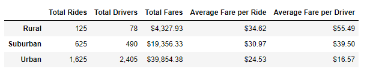
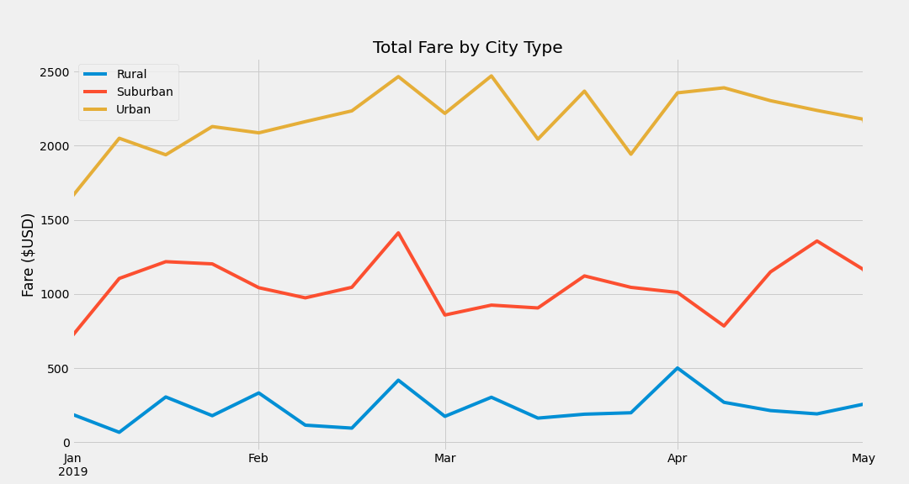
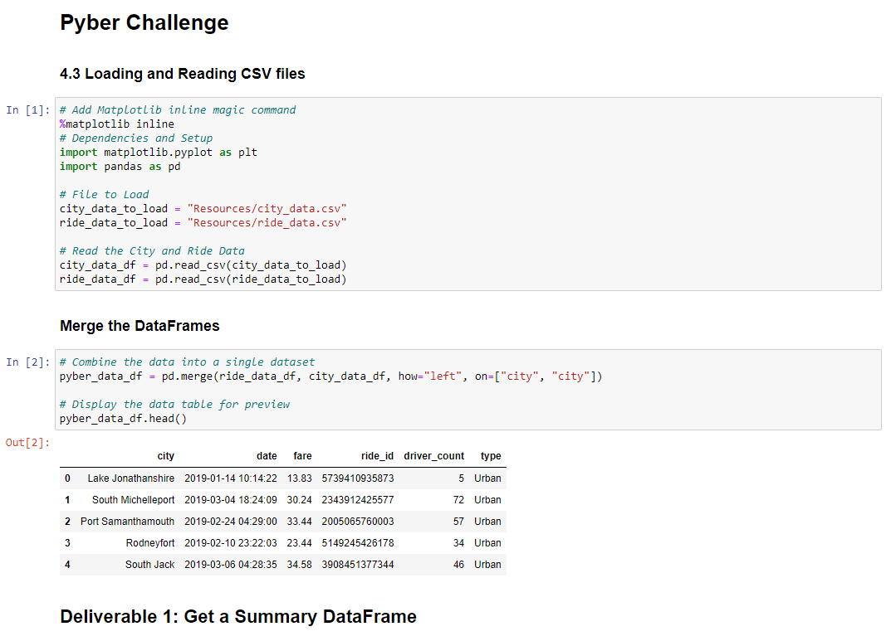
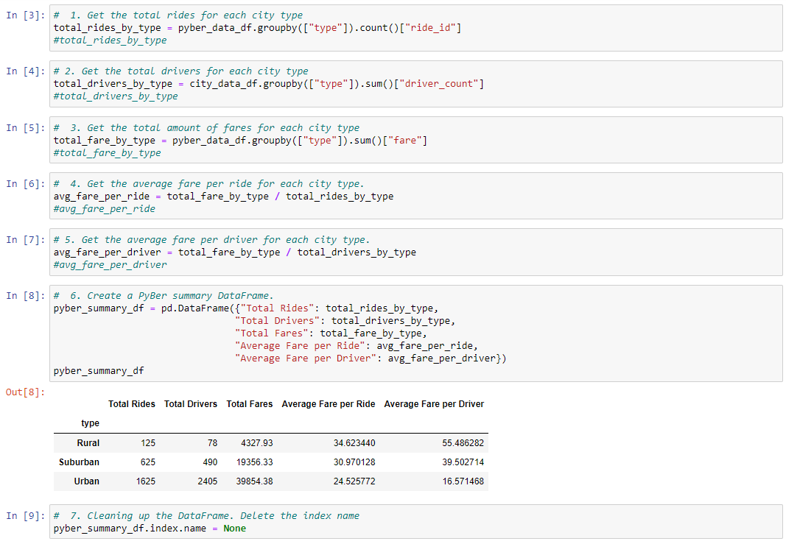
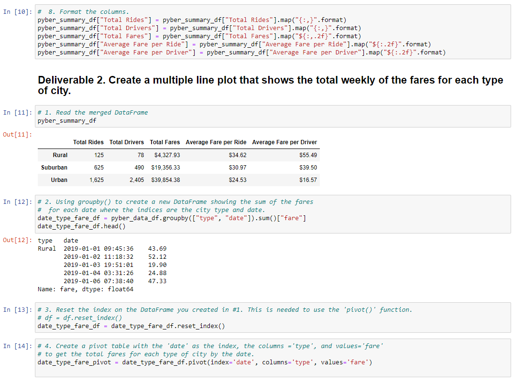
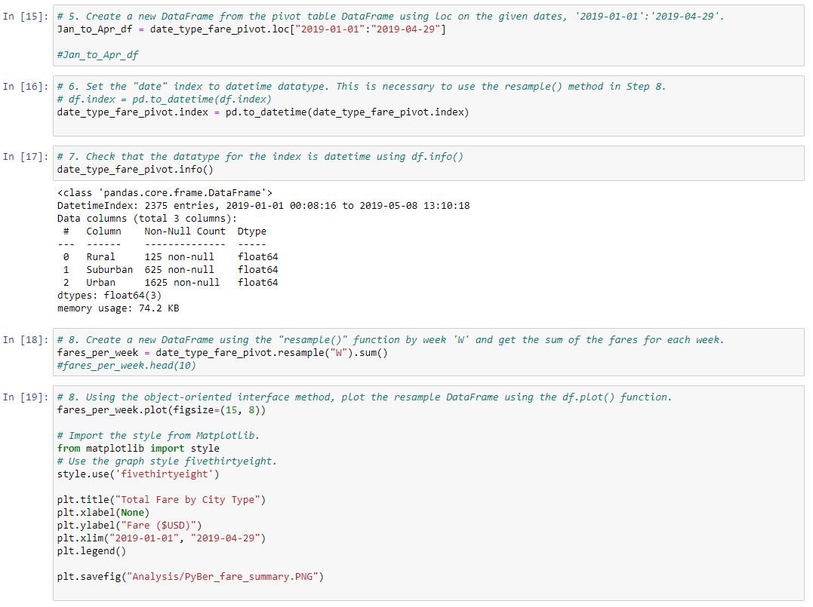

# PyBer_Analysis

## Overview of Project

**Purpose:**  
V. Isualize, the CEO of a ride sharing company called Pyber, has tasked us with analyzing data and creating visualizations from January to early May for the 2019 year. She was impressed with our initial analysis and has given Omar and I another assignment. The purpose of this analysis is to use Python and Pandas to create a new summary DataFrame and multiple-line graph that shows the total weekly fares for each city type.

## Resources:
- Data Source: city_data.csv, ride_data.csv
- Software: Python 3.9.7, Anaconda 4.10.3, Jupyter Notebook 6.4.5

## Analysis and Results

**Analysis:**  
For this analysis, we were provided with a dataset for city data and a dataset for ride data. The city information had information on city name, the number of drivers in the particular city, and the city type(urban, suburban, rural). The ride dataset has information on the city name, date and time of the rides, the fare of the ride, and the ride ID. Looking at our datasets, city name was one data that they both had in common, so we were able to combine them through the city name. From there, we performed calculations to find the total rides, total drivers, and total fare for each city type. This information was then used to calculate the average fare per ride and the average fare per driver. Then we were able to join all of the calculations into a new summary dataframe.  
  
The next item for our analysis is to create a multi-line graph for total weekly fares by each city type. Going back to our combined dataset, we were able to use a method called `pivot.()`, which is similar to creating a pivot table in Excel, to essentially create a pivot table within Jupyter Notebook. We resampled the data into weeks, then we created the graph that V. Isualize asked us to create.  
  

**Results:**  
From our analysis, we can see that there are differences in values between the different city types of our data. Though rural areas have the least number of total rides and drivers, but they yield higher average fare per ride and average fare per driver when compared to suburban and urban city types. This could be because the length of each ride is longer and/or further compared to suburban or urban areas, which would increase the fare of each ride. The same could be true for why there might be lower total rides and total drivers because the distance between destinations are further, thus would increase the fare for each ride and people would shy away from taking Pyber due to the higher cost of the ride. This could also be a contributor to why there are less drivers overall in rural areas.  

On the other hand, when we look at urban city type, we can see that there is over 10x the amount of number of rides compared to rural city type. We know that urban cities are more populated compared to rural areas, therefore it makes sense on why the total number of rides are higher. Average fare per ride and average fare per driver are lower potentially because the consumer's destination is not as far away compared to a consumer's destination in a rural area (with other factors considered equal). Looking at the multi-line graph, we can see from January to beginning of May, the overall revenue of our service came from urban areas and not so much from rural areas. Even though there are higher averages per ride and per driver from rural areas, but because there are more rides in the urban areas, it allows higher efficiency for the drivers. Meaning that if we have a driver in an urban area, they might be giving rides one after another with minimal wait time between consumers. As opposed to a rural area, where the wait time between consumers is higher due to the lower population of the area, as well as other factors discussed earlier in this analysis for lower total rides.  

## Challenge Summary

**Summary**  
1. One business recommendation would be to increase the number of drivers in areas where there are higher demand. This may increase consumer satisfaction and public relations due to higher effiency of our drivers. The down side would be decreases in number of rides per driver, which the drivers may be less motivated to continue to work because the market for drivers would be saturated and difficult to give as many rides as a driver.  
2. Another business recommendation, that is opposite of the first, is to decrease number of drivers in population dense areas. This would increase demand by lowering supplies, so there could be an increase in average fare per ride and would keep our drivers busy and working hard. But the downside of this would be that consumers would be less satisfied because it would be more difficult to catch a ride when we don't have as many drivers and the current drivers are already busy giving rides to someone else. Eventually, this strategy would fail because more people would want to be drivers due to the market's high demand for drivers.  
3. A third recommendation would be to host or sponsor events where alcohol is involved. Hear me out. People would need a safe way to be transported to and from the event safely and avoiding any DUIs. So if the attendees were to take PyBer, this would increase total ride count, thus increasing revenue.  

### Codes Used  
  
  
  
  